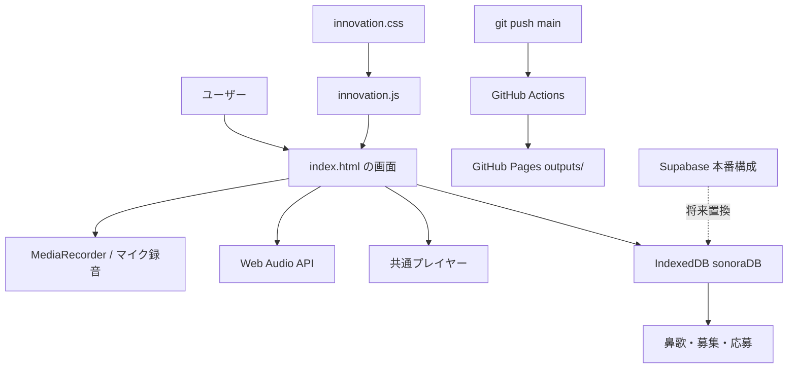

# アーキテクチャ

## 全体像



## ブラウザでページが開く順番

1. `outputs/index.html` が読み込まれる
2. HTML内の基本CSSが適用される
3. `innovation.css` が追加機能のCSSを上書きする
4. HTML末尾のJavaScriptが録音・音声・DBを初期化する
5. `innovation.js` がCreative Networkの画面をDOMへ追加する
6. IndexedDBから投稿と募集を読み込む
7. ユーザー操作に応じて音声生成・保存・画面更新が行われる

## 各ファイルの責務

### `outputs/index.html`

アプリケーションの中心です。

- 基本ページのHTML
- 基本デザインのCSS
- マイク録音
- 音量メーター
- 効果音・BGM合成
- 下部プレイヤー
- IndexedDB
- ログインデモ
- 投稿・募集・応募

現在は学習用プロトタイプのため一つのファイルにまとまっています。本番化時はHTML、CSS、音声処理、DB処理を別モジュールへ分割します。

### `outputs/innovation.js`

基本機能の上に追加される実験的機能を担当します。

- Before → AI → Creator比較
- Sound Wanted
- Creator Battle
- YouTuber Sound Pack
- 動画タイムライン
- Sound DNA
- Remix Tree
- 使用追跡・ライセンス

既存の `playEffectPreset()` や `playMachine()` を呼び出しているため、音声エンジンを重複実装していません。

### `outputs/innovation.css`

`innovation.js` が生成する画面と、サイト全体の統一スタイルを担当します。

### `supabase-setup.sql`

ブラウザ内DBをオンラインDBへ置き換えるための設計です。

- 募集テーブル
- 応募テーブル
- 音声Storage
- Row Level Security

### `.github/workflows/deploy-pages.yml`

GitHub Pagesへの自動公開処理です。`main` ブランチへのpushを検知し、`outputs/` を公開用成果物としてアップロードします。

## 主なユーザーフロー

### 鼻歌から募集する

```text
録音ボタン
  → record()
  → MediaRecorder
  → setCapturedAudio()
  → AI見本または生音声を選択
  → openRequest()
  → requestPostsへ保存
  → 募集中一覧へ表示
```

### 音を再生する

```text
再生ボタン
  → playSoundItem()
  ├─ 録音音声: playMediaItem()
  ├─ 効果音: playEffectPreset()
  └─ BGM: playMachine()
  → 共通下部プレイヤー
```

### 公開する

```text
git push origin main
  → GitHub Actions
  → outputs/をPages artifactへ変換
  → GitHub Pagesへ公開
```

