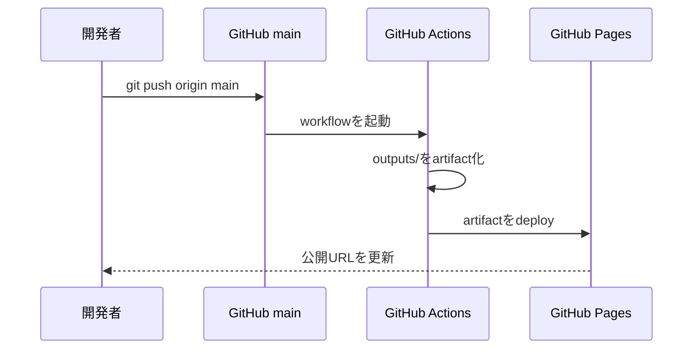

# 公開手順

## 現在の公開先

https://sakana14-cyber.github.io/sonora/

## 自動公開の仕組み



## 通常の更新

```bash
git status
git add .
git commit -m "変更内容を短く説明"
git push origin main
```

`main` へのpushで `.github/workflows/deploy-pages.yml` が動きます。

## ワークフローの役割

| ステップ | 役割 |
|---|---|
| `actions/checkout` | GitHubからコードを取得 |
| `configure-pages` | Pages環境を準備 |
| `upload-pages-artifact` | `outputs/` を公開ファイルとして梱包 |
| `deploy-pages` | GitHub Pagesへ配置 |

## 公開に含まれるファイル

GitHubリポジトリ全体ではなく、`outputs/` の中だけがWebサイトとして公開されます。

```text
outputs/
├─ index.html
├─ innovation.css
├─ innovation.js
└─ .nojekyll
```

`docs/` や `supabase-setup.sql` はGitHubでは読めますが、WebサイトのURLからは配信されません。

## 失敗したとき

1. GitHubの `Actions` を開く
2. `Deploy Sonora to GitHub Pages` を選ぶ
3. 赤くなった実行を開く
4. 失敗したステップを確認する
5. `Settings → Pages → Source` が `GitHub Actions` か確認する

## 本番サービスへ進む場合

GitHub Pagesは静的ホスティングです。秘密鍵を必要とするAI生成や決済処理は実行できません。

本番化時は次の構成へ移行します。

```text
フロントエンド: Vercel
ログイン・DB・音声: Supabase
AI生成API: Vercel Functions経由
決済: Stripe Connect
```

